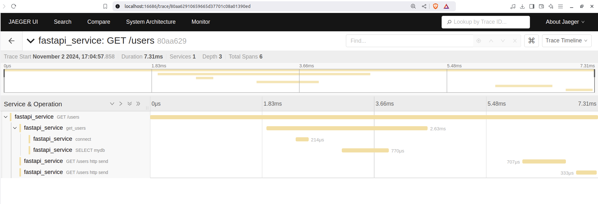

# FastAPI, PostgreSQL, and OpenTelemetry Tracing with Jaeger

This tutorial provides a setup for deploying a FastAPI application with a PostgreSQL database and tracing using OpenTelemetry with Jaeger on Kubernetes.

## Table of Contents

- [Introduction](#introduction)
- [Project Structure](#project-structure)
- [Setup Guide](#setup-guide)
- [Deployment](#deployment)
- [Viewing Traces in Jaeger](#viewing-traces-in-jaeger)
- [Understanding the Code](#understanding-the-code)
- [Troubleshooting](#troubleshooting)
- [Conclusion](#conclusion)

---

## Introduction

**OpenTelemetry** is essential for monitoring and troubleshooting modern applications. It provides distributed tracing, which tracks requests as they traverse multiple services, databases, and APIs. With distributed tracing, developers gain insights into the performance and dependencies of each component, enabling better debugging and optimization. 

In this project, **Jaeger** is used as the tracing backend to collect and visualize trace data from the FastAPI application. Jaeger helps observe latency, bottlenecks, and service dependencies, crucial for diagnosing production issues. There are also alternatives to Jaeger, such as **Zipkin** and **Honeycomb**, each offering unique features for trace storage and visualization.

## Project Structure

Clone this repository to get started:

```bash
git clone https://github.com/PraveenBSD/OpenTelemetry.git
cd OpenTelemetry
```

The project structure includes:

```
project-root/
│
├── app/                    # FastAPI application code
│   ├── main.py                    # Main FastAPI app file
│   ├── Dockerfile                 # Dockerfile for FastAPI app
│   └── requirements.txt           # Python dependencies
│
├── k8s/                           # Kubernetes deployment files
│   ├── api.yaml                   # FastAPI deployment on Kubernetes
│   ├── postgres.yaml              # PostgreSQL deployment on Kubernetes
│   └── jaeger.yaml                # Jaeger deployment on Kubernetes
│
└── README.md               # This README file
```

## Setup Guide

### 1. FastAPI Application (`api_server`)

The FastAPI server provides an API to retrieve user information from PostgreSQL, using OpenTelemetry for tracing.

- **main.py**: FastAPI code for `/users/{user_id}` endpoint, database setup, and OpenTelemetry tracing.
- **Dockerfile**: Builds the FastAPI application container image.
- **requirements.txt**: Lists dependencies, including FastAPI and OpenTelemetry.

### 2. PostgreSQL Database (`k8s/postgres.yaml`)

Defines the Kubernetes Deployment and Service for PostgreSQL, storing user data accessed by the FastAPI application.

### 3. Jaeger Tracing (`k8s/jaeger.yaml`)

Jaeger collects trace data and offers a UI for visualizing traces.

## Deployment

### Prerequisites

1. **Docker**: Ensure [Docker](https://docs.docker.com/get-docker/) is installed and running.
2. **Kubernetes Cluster**: Use [Minikube](https://minikube.sigs.k8s.io/docs/start/) or any Kubernetes setup.
3. **kubectl**: [kubectl](https://kubernetes.io/docs/tasks/tools/install-kubectl/) for managing Kubernetes resources.

### Step 1: Build the Docker Image (Optional)

If you prefer to use a prebuilt image, skip this step. Otherwise, navigate to `api_server` and build the FastAPI Docker image:

```bash
cd api_server
docker build -t your-docker-repo/api-server:latest .
```

Push this image to your Docker repository if deploying to a remote Kubernetes cluster:

```bash
docker push your-docker-repo/api-server:latest
```

Alternatively, pull the image directly from `<your-docker-registry>` by modifying `api_server_deployment.yaml`.

### Step 2: Deploy Jaeger

Deploy Jaeger with:

```bash
kubectl create -f k8s/jaeger.yaml
```

Jaeger UI is available on port `16686` (accessible via `http://localhost:16686` if port-forwarded).

### Step 3: Deploy PostgreSQL

Deploy PostgreSQL:

```bash
kubectl create -f k8s/postgres.yaml
```

This creates the PostgreSQL instance for FastAPI.

### Step 4: Deploy the FastAPI Application

Deploy the FastAPI app:

```bash
kubectl create -f k8s/api.yaml
```

The API server is available on port `8000` (accessible via `http://localhost:8000` if port-forwarded).

#### Port-forward Services for Local Access

1. **Jaeger UI**:

   ```bash
   kubectl port-forward service/jaeger 16686:16686
   ```

   Access Jaeger at `http://localhost:16686`.

2. **API Server**:

   ```bash
   kubectl port-forward service/fastapi-service 8000:80
   ```

   Access the API server at `http://localhost:8000`.

#### Test the API Endpoint
You can test the API endpoints using the following `curl` commands:

1. **Create a User**:
```bash
curl -X POST "http://localhost:8000/users" -H "Content-Type: application/json" -d '{"name": "John Doe", "email": "john.doe@example.com"}'
```
2. **Get All Users**:

```bash
curl -X GET "http://localhost:8000/users"
```
3. **Get User by ID**:
```bash
curl -X GET "http://localhost:8000/users/1"
```

## Viewing Traces in Jaeger

1. Access Jaeger’s **Search** tab at `http://localhost:16686`.
2. Select the **fastapi-server** service from the dropdown.
3. Click **Find Traces** to view API traces.

Jaeger will display each trace’s:

- **Network latency**: API request duration.
- **Database query time**: PostgreSQL query duration.

### Example Screenshots

1. **Sample Trace in Jaeger**:

   
   The screenshot shows a GET /users request trace with the following breakdown:

   - **Total Duration**: 7.31 ms
   - **Service & Operation**:
      - The fastapi_service shows multiple spans corresponding to different operations:
         - connect: Establishing the database connection.
         - SELECT mydb: Executing the SQL query to fetch users.
         - HTTP send spans showing the duration of each stage in the request-response cycle.

   Jaeger UI enables you to see latency for each step, helping in identifying bottlenecks and analyzing application performance.

## Understanding the Code

The following code snippet shows how to set up OpenTelemetry for the FastAPI application:

```python
trace.set_tracer_provider(
    TracerProvider(
        resource=Resource.create({"service.name": "fastapi_service"})
    )
)
tracer = trace.get_tracer(__name__)

jaeger_exporter = JaegerExporter(
    agent_host_name=os.getenv("OTEL_EXPORTER_JAEGER_AGENT_HOST", "jaeger"),
    agent_port=6831,
)

span_processor = BatchSpanProcessor(jaeger_exporter)
trace.get_tracer_provider().add_span_processor(span_processor)

# FastAPI setup with OpenTelemetry
app = FastAPI()
FastAPIInstrumentor.instrument_app(app)
SQLAlchemyInstrumentor().instrument(engine=engine)
```

### Explanation of the Code

1. **Setting Tracer Provider**:
   - `trace.set_tracer_provider(...)`: Initializes a tracer provider with resource information, specifically naming the service `fastapi_service`. This identifies the source of trace data in Jaeger.

2. **Getting a Tracer**:
   - `tracer = trace.get_tracer(__name__)`: Retrieves a tracer instance for the current module, used to create spans (units of work).

3. **Jaeger Exporter Setup**:
   - `jaeger_exporter = JaegerExporter(...)`: Configures the Jaeger exporter to send traces to the Jaeger agent. The host and port can be customized using environment variables.

4. **Span Processor**:
   - `span_processor = BatchSpanProcessor(jaeger_exporter)`: Uses a batch processor to send spans to Jaeger in groups, optimizing network usage.
   - `trace.get_tracer_provider().add_span_processor(span_processor)`: Registers the span processor with the tracer provider.

5. **Instrumenting FastAPI and SQLAlchemy**:
   - `FastAPIInstrumentor.instrument_app(app)`: Automatically instruments the FastAPI app, capturing traces for incoming requests.
   - `SQLAlchemyInstrumentor().instrument(engine=engine)`: Instruments SQLAlchemy to trace database queries and operations.

## Troubleshooting

- **Service not found in Jaeger**: Check `OTEL_EXPORTER_JAEGER_AGENT_HOST` in `api_server_deployment.yaml`.
- **Database connection issues**: Confirm PostgreSQL is accessible by the FastAPI pod.
- **No traces in Jaeger**: Verify OpenTelemetry configuration in `main.py`.

## Conclusion

This setup provides a foundation for monitoring API performance and database interactions in a microservices environment. With OpenTelemetry and Jaeger, you can gain insights into your application's behavior, helping identify performance bottlenecks and improve reliability. Happy tracing!

## Further Reading

To deepen your understanding of OpenTelemetry and tracing, consider exploring these resources:

- **[OpenTelemetry Documentation](https://opentelemetry.io/docs/)**: Official documentation for getting started with OpenTelemetry.
- **[Jaeger Documentation](https://www.jaegertracing.io/docs/latest/)**: Learn more about Jaeger, its setup, and usage.
- **[OpenTelemetry Instrumentation for Python](https://opentelemetry-python.readthedocs.io/en/latest/)**: A guide on integrating OpenTelemetry with Python applications.
- **[Distributed Tracing Basics](https://opentelemetry.io/docs/concepts/signals/traces/)**: Overview of distributed tracing concepts in OpenTelemetry.
- **[OpenTelemetry No-Code Instrumentation](https://opentelemetry.io/docs/zero-code/)**: Guide on enabling no-code instrumentation to collect telemetry data without modifying application code.
